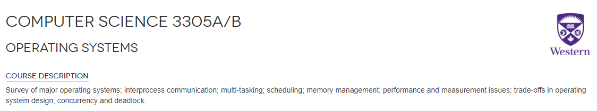
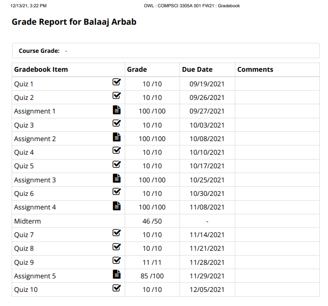

# OS-Course-Assignments

My submissions for the 5 assignments of this course. Written in C.

Primary topic considered by each assignment:

Asn 1: Process Forking

Asn 2: Pipes/Communicating between processes

Asn 3: Threads

Asn 4: Simulation of a RR CPU Scheduling Algorithm

Asn 5: Mutual Exclusion/Threads

---

